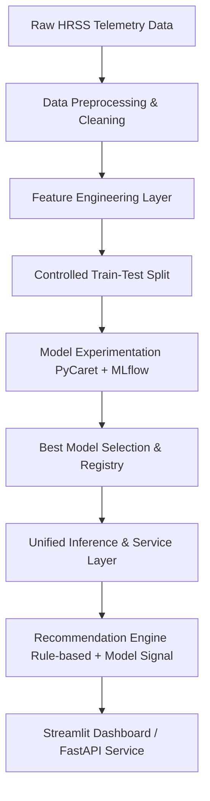

# HRSS Recommendation System
> **Industrial Operational Recommendation System based on High Rack Storage System (HRSS) Telemetry**

[](https://www.python.org/)
[]()
[]()
[]()

---

## 📌 Project Overview
Modern industrial automation systems (conveyors, rails, automated storage) run continuously to move materials, which consumes a high amount of operational energy. Inefficient movement patterns lead to higher power usage, idle movements, and slower operational cycles. 

This project implements an **Industrial Operational Recommendation System** using telemetry sensor data from the **High Rack Storage System (HRSS)** at the Smart Factory Lemgo, Germany. The system processes time-series telemetry data, runs automated machine learning experiments to classify the operations, and provides actionable recommendations to optimize operational strategy (e.g., using simultaneous movement patterns) to reduce energy consumption.

### Key Objectives
* **Analyze Operational Behavior**: Compare standard (non-optimized) and optimized simultaneous movement scenarios.
* **Operational Pattern Recognition**: Build binary classification models (`operation_type`: `0` for standard, `1` for optimized) based on sensor telemetry.
* **Energy Consumption Analytics**: Understand the correlation between movement patterns and electrical power consumption.
* **Decision Support & Recommendations**: Provide real-time actionable recommendations to shift operational states toward optimal configurations.

---

## 🛠️ Tech Stack & Key Tools
* **Data Processing & ML Pipeline**: `pandas`, `numpy`, `scikit-learn`, `xgboost`
* **Automated Machine Learning**: `PyCaret` (for fast model selection and prototyping)
* **MLOps & Experiment Tracking**: `MLflow` (for tracking runs, metrics, and models)
* **API Endpoints**: `FastAPI` & `Uvicorn` (for deployment-ready model serving)
* **User Interface**: `Streamlit` (for interactive dashboards and model comparison)
* **DevOps**: `Docker` & `Docker Compose`

---

## 📂 Project Directory Structure
The codebase follows a modular, production-ready, and scalable layout conforming to professional MLOps practices:

```
HRSS_recommendation_system/
├── configs/                  # Global, model, and feature configuration files
├── data/                     # Raw, interim, processed, and fixed split datasets
├── docs/                     # Comprehensive architecture and design documents
├── experiments/              # Jupyter notebooks & MLflow tracking runs (mlruns)
│   └── notebooks/
│       ├── 01_data_understanding.ipynb
│       ├── 02_feature_engineering.ipynb
│       ├── 03_model_experiments.ipynb
│       ├── 04_model_evaluation_comparison.ipynb
│       └── 05_recommendation_engine.ipynb
├── src/                      # Core production source code
│   ├── api/                  # FastAPI app and endpoint routes
│   ├── core/                 # Domain schema and problem definitions
│   ├── data/                 # Ingestion, preprocessing, and splitting pipeline
│   ├── features/             # Feature builders and validators
│   ├── models/               # Model training, registry, and inference services
│   ├── recommendation/       # Rule engines, scoring, and decision policy
│   ├── services/             # Unified prediction and recommendation services
│   └── utils/                # I/O utilities, logging, and configuration loader
├── app/                      # Streamlit application code (dashboard pages & UI)
├── tests/                    # Integration and unit tests
├── deployment/               # Dockerfiles and Kubernetes manifests
└── monitoring/               # Model drift and performance tracking scripts
```

---

## 🏗️ System Architecture



### Core Architecture Layers:
1. **Data Layer**: Clean separation of raw telemetry and processed/split data to prevent data leakage.
2. **Feature Layer**: Creates domain-specific features (e.g., total power, conveyor/rail activity indices) representing operational behavior.
3. **Model Layer**: Trains classifiers (`Logistic Regression`, `Decision Tree`, `Random Forest`, `XGBoost`) tracking metrics under MLflow.
4. **Service Layer**: Decouples ML models from the interface, serving predictions and recommendations via standard JSON response formats.
5. **Interface Layer**: Interactive user interface via Streamlit displaying system overview, simulation inputs, MLflow model comparison, and SHAP explainability.

---

## 🚀 Installation & Local Setup

### 1. Clone & Navigate
```bash
git clone https://github.com/Arfiadi/HRSS-recommendation-system.git
cd HRSS-recommendation-system
```

### 2. Environment Setup
Create a virtual environment (Python >= 3.8 is recommended) and activate it:
```bash
# Windows
python -m venv venv
venv\Scripts\activate

# Linux/macOS
python3 -m venv venv
source venv/bin/activate
```

### 3. Install Dependencies
You can install the dependencies package-style using `pyproject.toml` or directly from `requirements.txt`:
```bash
# Development installation
pip install -e .[dev,api]
```

### 4. Data Placement
Make sure to place your raw telemetry datasets under the raw directory:
* `data/raw/HRSS_normal_standard.csv`
* `data/raw/HRSS_normal_optimized.csv`
* `data/raw/HRSS_anomalous_standard.csv`
* `data/raw/HRSS_anomalous_optimized.csv`

---

## 💻 Usage & Execution

### Running Jupyter Experiments
Launch your notebooks to run exploratory analysis, feature engineering, and model validation:
```bash
jupyter notebook experiments/notebooks/
```

### Tracking Experiments with MLflow
Start the local MLflow dashboard to track runs, compare metrics, and select the best model:
```bash
mlflow ui --backend-store-uri ./experiments/mlruns
```
*Access the UI at `http://localhost:5000`*

### Launching the Streamlit Web Application
To run the dashboard UI locally:
```bash
streamlit run app/app.py
```
*Access the dashboard at `http://localhost:8501`*

### Serving the API (FastAPI)
Run the development API server:
```bash
uvicorn src.api.main:app --reload
```
*Access interactive swagger API documentation at `http://localhost:8000/docs`*

---

## 📊 Evaluation Framework
Models are evaluated not only on simple accuracy but also on business impact and operational risk:
* **Primary Metrics**: Macro F1-Score & ROC-AUC (ensures robust classification performance).
* **Risk Metrics**: False Negative Rate (FNR) & False Positive Rate (FPR) (minimizes incorrect recommendations that could cause energy wastage or operational hazards).
* **Secondary Metrics**: Precision & Recall for Class 1 (optimized operation).

---

## 📝 Authors & License
* **Developer**: Arfi ([arfiadi13@gmail.com](mailto:[EMAIL_ADDRESS]))
* **Dataset Source**: Smart Factory Lemgo, Germany
* **License**:
