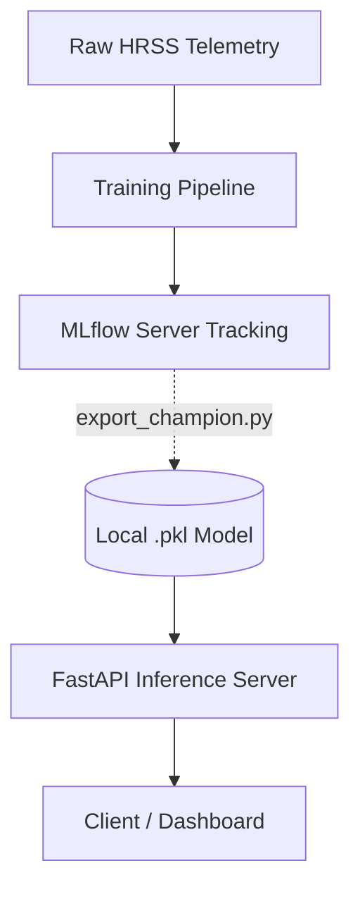

# HRSS Recommendation System
> **Industrial Operational Recommendation System based on High Rack Storage System (HRSS) Telemetry**

[](https://www.python.org/)
[]()
[]()

---

## 🌐 Live Demo & API Access
- **Frontend Dashboard**: [https://hrss-recommendation-system.vercel.app/](https://hrss-recommendation-system.vercel.app/)
- **Backend API Docs (Swagger)**: [https://hrss-recommendation-api.onrender.com/docs](https://hrss-recommendation-api.onrender.com/docs)

> [!WARNING]
> **Cold Start Notice**: The backend API is hosted on Render's free tier. If the system is not accessed for 15 minutes, the server will go to sleep. As a result, **the first initial loading may take 30-50 seconds** to wake the server up. Subsequent requests will be fast and normal.

---

## 📌 Project Overview
Modern industrial automation systems (conveyors, rails, automated storage) run continuously to move materials, which consumes a high amount of operational energy. Inefficient movement patterns lead to higher power usage, idle movements, and slower operational cycles. 

This project implements an **Industrial Operational Recommendation System** using telemetry sensor data from the **High Rack Storage System (HRSS)** at the Smart Factory Lemgo, Germany. The system processes time-series telemetry data, runs automated machine learning experiments to classify the operations, and provides actionable recommendations to optimize operational strategy (e.g., using smart path routing / warehouse path optimization) to reduce energy consumption.

### Key Objectives
* **Analyze Operational Behavior**: Compare standard (traditional routing) and optimized (smart routing) scenarios.
* **Operational Pattern Recognition**: Build binary classification models (`operation_type`: `0` for standard, `1` for optimized) based on sensor telemetry.
* **Energy Consumption Analytics**: Understand the correlation between movement patterns and electrical power consumption.
* **Decision Support & Recommendations**: Provide real-time actionable recommendations to shift operational states toward optimal configurations.

---

## 🛠️ Tech Stack & Key Tools
* **Data Processing & ML Pipeline**: `pandas`, `numpy`, `scikit-learn`, `xgboost`
* **MLOps & Experiment Tracking**: `MLflow` (for tracking runs, metrics, models, and plotting learning curves)
* **API Endpoints**: `FastAPI` & `Uvicorn` (for deployment-ready model serving)
* **DevOps**: `Docker` & `pytest`

---

## 📂 Project Directory Structure
The codebase follows a modular, production-ready layout conforming to professional MLOps practices:

```
HRSS_recommendation_system/
├── configs/                  # Global, model, and feature configuration files
├── data/                     # Raw, interim, processed, and fixed split datasets
├── docs/                     # Comprehensive architecture and design documents
├── experiments/              # Jupyter notebooks for data understanding & prototyping
├── outputs/                  # Generated figures (confusion matrix, learning curves)
├── src/                      # Core production source code
│   ├── api/                  # FastAPI app and endpoint routes
│   ├── core/                 # Domain schema and problem definitions
│   ├── data/                 # Ingestion, preprocessing, and splitting pipeline
│   ├── features/             # Feature builders and validators
│   ├── models/               # Model training, offline baking, and local loading
│   ├── pipeline/             # Training and Inference orchestration pipelines
│   ├── recommendation/       # Rule engines, scoring, and decision policy
│   ├── scripts/              # CI/CD scripts (e.g., export_champion.py)
│   └── services/             # Unified prediction and recommendation services
└── tests/                    # Integration and unit tests
```

> **Note**: For deep-dives into specific folders, please read the localized `README.md` inside `data/`, `src/api/`, and `experiments/`. For architecture choices, see the `docs/` folder.

---

## 🏗️ System Architecture (Offline Baking)


```mermaid
graph TD
    A[Raw HRSS Telemetry] --> B[Training Pipeline]
    B --> C[MLflow Server Tracking]
    C -.->|export_champion.py| D[(Local .pkl Model)]
    D --> E[FastAPI Inference Server]
    E --> F[Client / Dashboard]
```

This project uses the **Offline Baking** architecture. The training pipeline logs everything to MLflow, but the production API Server (FastAPI) does *not* talk to MLflow. Instead, the champion model is exported locally as a `.pkl` file to ensure the API server stays robust, fast, and completely isolated from MLflow downtime.

---

## 🚀 Installation & Local Setup

### 1. Clone & Navigate
```bash
git clone https://github.com/Arfiadi/HRSS-recommendation-system.git
cd HRSS-recommendation-system
```

### 2. Environment Setup
Create a virtual environment (Python >= 3.8 is recommended) and activate it:
```bash
# Windows
python -m venv venv
venv\Scripts\activate

# Linux/macOS
python3 -m venv venv
source venv/bin/activate
```

### 3. Install Dependencies
We use `pyproject.toml` for modern dependency management. We have separated the libraries based on functionality to save deployment memory size:
```bash
# For Production API Server only (Lightweight)
pip install -e .[api]

# For Development (Includes Testing tools)
pip install -e .[api,dev]

# For Data Scientists (Training & Visualization tools)
pip install -e .[api,train,notebooks]
```

### 4. Data Placement
Make sure to place your raw telemetry datasets under the raw directory:
* `data/raw/HRSS_normal_standard.csv`
* `data/raw/HRSS_normal_optimized.csv`

---

## 💻 Usage & Execution

### Running the End-to-End Training Pipeline
To run data ingestion, preprocessing, feature engineering, model training, and MLflow logging:
```bash
python -m src.pipeline.train_pipeline
```
*(This will also generate Learning Curve and Confusion Matrix plots in `outputs/figures/`)*

### Tracking Experiments with MLflow
Start the local MLflow dashboard to track runs and compare metrics:
```bash
mlflow ui
```
*Access the UI at `http://localhost:5000`*

### Running the Application (Backend & Frontend)
To easily start both the FastAPI server and the modern React/Vite dashboard simultaneously, use the provided unified runner script:
```bash
python run.py
```
> **Windows Users**: You can also simply double-click the `run.bat` file in the project root to start the system without opening a terminal manually.

These scripts will automatically verify dependencies, activate environments, and start both services.
* **Frontend Dashboard**: `http://localhost:5173`
* **Backend API Docs**: `http://localhost:8000/docs`

### Exporting the Champion Model
Export the best model from MLflow into the local system for the API to use:
```bash
python -m src.scripts.export_champion
```


---

## 🧪 Testing
To run the automated test suite (Unit and Integration tests):
```bash
python -m pytest
```

---

## 📝 Authors & License
* **Developer**: Arfi
* **Dataset Source**: Smart Factory Lemgo, Germany
* **License**: -
