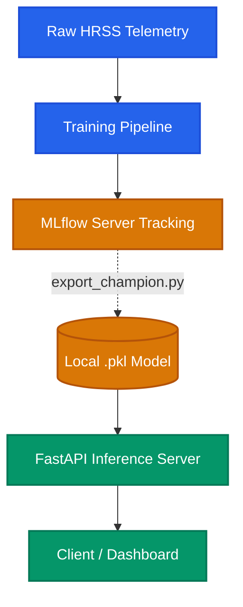

<div align="center">
  

  <h1>🏭 HRSS Recommendation System</h1>
  <p><b>Industrial Operational Recommendation System based on High Rack Storage System (HRSS) Telemetry</b></p>
  
  <p>
    <a href="https://www.python.org/"></a>
    <a href="https://fastapi.tiangolo.com/"></a>
    <a href="https://react.dev/"></a>
    <a href="https://mlflow.org/"></a>
  </p>
  
  <p>
    <a href="#-project-overview">Overview</a> •
    <a href="#-live-demo--api-access">Live Demo</a> •
    <a href="#-tech-stack">Tech Stack</a> •
    <a href="#-system-architecture">Architecture</a> •
    <a href="#-installation--local-setup">Installation</a>
  </p>
</div>

---

## 🌐 Live Demo & API Access

Explore the live application and API documentation:

| Service | Link | Description |
|:---|:---|:---|
| **Frontend Dashboard** | [hrss-recommendation-system.vercel.app](https://hrss-recommendation-system.vercel.app/) | Interactive React UI for system monitoring |
| **Backend API (Swagger)** | [hrss-recommendation-api.onrender.com/docs](https://hrss-recommendation-api.onrender.com/docs) | Complete API documentation and playground |

> [!WARNING]
> **Cold Start Notice:** The backend API is hosted on Render's free tier. If the system is inactive for 15 minutes, the server enters sleep mode. Consequently, **the initial request may take 30-50 seconds** to wake the server. Subsequent requests will process at normal speeds.

---

## 📌 Project Overview

Modern industrial automation systems (conveyors, rails, automated storage) run continuously to move materials, which consumes a high amount of operational energy. Inefficient movement patterns lead to higher power usage, idle movements, and slower operational cycles. 

This project implements an **Industrial Operational Recommendation System** using telemetry sensor data from the **High Rack Storage System (HRSS)** at the Smart Factory Lemgo, Germany. The system processes time-series telemetry data, runs automated machine learning experiments to classify operations, and provides actionable recommendations to optimize operational strategy (e.g., smart path routing) to reduce energy consumption.

### ✨ Key Capabilities

* 🧠 **Hybrid AI Architecture:** Combines Machine Learning (Random Forest) for pattern recognition with a deterministic Rule Engine (Domain Knowledge) for safety overrides (Neuro-Symbolic approach).
* 📊 **Operational Pattern Recognition:** Binary classification models (`0` for standard, `1` for optimized) based on sensor telemetry.
* ⚡ **Prescriptive Analytics:** Real-time actionable recommendations to shift operational states toward optimal configurations.
* 📈 **OEE-style Scoring:** Industrial-grade efficiency scoring system (0-100%) that penalizes inefficient routing and physical electrical anomalies (e.g., Extreme Power Loads, Voltage Sags).

---

## 🛠️ Tech Stack

<div align="center">
  <table>
    <tr>
      <td align="center"><b>Data Processing & ML</b></td>
      <td align="center"><b>MLOps & API</b></td>
      <td align="center"><b>Frontend & DevOps</b></td>
    </tr>
    <tr>
      <td>
        
        <br />
        
        <br />
        
      </td>
      <td>
        
        <br />
        
        <br />
        
      </td>
      <td>
        
        <br />
        
        <br />
        
      </td>
    </tr>
  </table>
</div>

---

## 🏗️ System Architecture

This project utilizes an **Offline Baking** architecture. The training pipeline logs metrics to MLflow, while the production API Server (FastAPI) loads the exported champion model locally. This ensures the API remains robust, low-latency, and isolated from MLflow downtime.


```mermaid
graph TD
    classDef primary fill:#2563eb,stroke:#1d4ed8,stroke-width:2px,color:#fff;
    classDef secondary fill:#059669,stroke:#047857,stroke-width:2px,color:#fff;
    classDef storage fill:#d97706,stroke:#b45309,stroke-width:2px,color:#fff;
    
    A[Raw HRSS Telemetry]:::primary --> B[Training Pipeline]:::primary
    B --> C[MLflow Server Tracking]:::storage
    C -.->|export_champion.py| D[(Local .pkl Model)]:::storage
    D --> E[FastAPI Inference Server]:::secondary
    E --> F[Client / Dashboard]:::secondary
```

---

## 📂 Directory Structure

```text
HRSS_recommendation_system/
├── configs/                  # Global, model, and feature configuration files
├── data/                     # Raw, interim, processed, and fixed split datasets
├── docs/                     # Comprehensive architecture and design documents
├── experiments/              # Jupyter notebooks for data exploration & prototyping
├── outputs/                  # Generated figures (confusion matrix, learning curves)
├── src/                      # Core production source code
│   ├── api/                  # FastAPI application and endpoint routes
│   ├── core/                 # Problem definitions and global constants
│   ├── data/                 # Ingestion, preprocessing, and splitting
│   ├── features/             # Feature builders and stateless aggregates
│   ├── models/               # Model training, offline baking, and loading
│   ├── pipeline/             # Training and Inference orchestration
│   ├── recommendation/       # Hybrid expert system: Rules, scoring, policy
│   ├── scripts/              # CI/CD scripts (e.g., export_champion.py)
│   └── services/             # Unified prediction and recommendation 
└── tests/                    # Integration and unit test suite
```

> [!NOTE]
> For deep-dives into specific components, refer to the localized `README.md` files inside `data/`, `src/api/`, and `experiments/`. Architecture choices are detailed in the `docs/` folder.

---

## 🚀 Installation & Local Setup

### 1. Clone & Navigate
```bash
git clone https://github.com/Arfiadi/HRSS-recommendation-system.git
cd HRSS-recommendation-system
```

### 2. Environment Setup
Create and activate a virtual environment (Python >= 3.8 recommended):
```bash
# Windows
python -m venv venv
venv\Scripts\activate

# Linux/macOS
python3 -m venv venv
source venv/bin/activate
```

### 3. Install Dependencies
Using modern dependency management via `pyproject.toml`, install only what you need:
```bash
# Production API Server only (Lightweight)
pip install -e .[api]

# Development (Includes Testing tools)
pip install -e .[api,dev]

# Data Scientists (Training & Visualization tools)
pip install -e .[api,train,notebooks]
```

### 4. Data Placement
Ensure your raw telemetry datasets are placed correctly:
* `data/raw/HRSS_normal_standard.csv`
* `data/raw/HRSS_normal_optimized.csv`

---

## 💻 Usage & Execution

### 🚄 Running the End-to-End Pipeline
Execute data ingestion, preprocessing, feature engineering, and MLflow logging:
```bash
python -m src.pipeline.train_pipeline
```
*(Generates Learning Curve and Confusion Matrix plots in `outputs/figures/`)*

### 📊 Tracking with MLflow
Launch the local MLflow dashboard to track runs and compare metrics:
```bash
mlflow ui
```
*Access UI at [http://localhost:5000](http://localhost:5000)*

### 🔄 Exporting the Champion Model
Export the best model from MLflow into the local system for API usage:
```bash
python -m src.scripts.export_champion
```

### 🌍 Starting the Application
Start both the FastAPI backend and React/Vite frontend simultaneously:
```bash
python run.py
```
> **Windows Users:** You can simply double-click `run.bat` in the project root to start everything without manually opening a terminal.

* **Frontend Dashboard:** [http://localhost:5173](http://localhost:5173)
* **Backend API Docs:** [http://localhost:8000/docs](http://localhost:8000/docs)

---

## 🧪 Testing

Run the automated test suite (Unit and Integration tests):
```bash
python -m pytest
```

---

<div align="center">
  <p>Built with ❤️ by <b>Arfi</b> | Data provided by <b>Smart Factory Lemgo, Germany</b></p>
</div>
